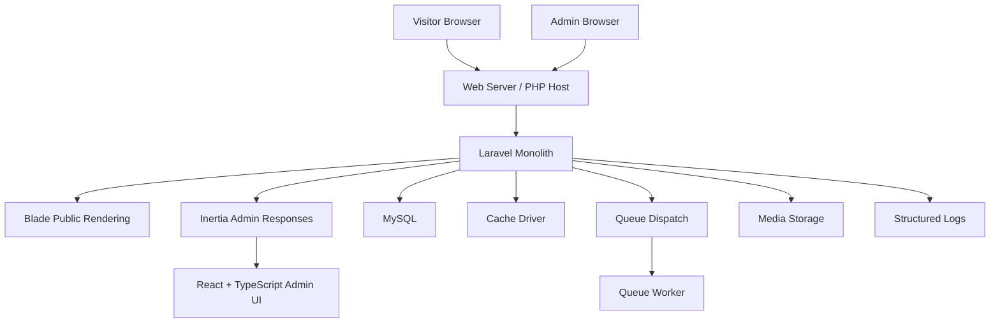

# Container Diagram

## Application Containers

## Container Responsibilities

- Web server or PHP host terminates HTTP requests and serves the Laravel application.
- Laravel monolith coordinates routing, authentication, authorization, validation, domain logic, public rendering, and admin responses.
- Blade public rendering handles SEO-critical public pages with low JavaScript overhead.
- Inertia admin responses bridge Laravel controllers to React pages without creating a separate API-first admin application for launch.
- React and TypeScript power authenticated admin interactions only.
- MySQL stores content, settings, users, inquiries, and related operational records.
- Cache driver stores short-lived computed results and shared operational values.
- Queue worker processes image derivatives, exports, and other deferred jobs.
- Media storage keeps uploaded originals and processed derivatives according to the chosen storage strategy.
- Structured logs capture application events, failures, and security-relevant operational signals.
