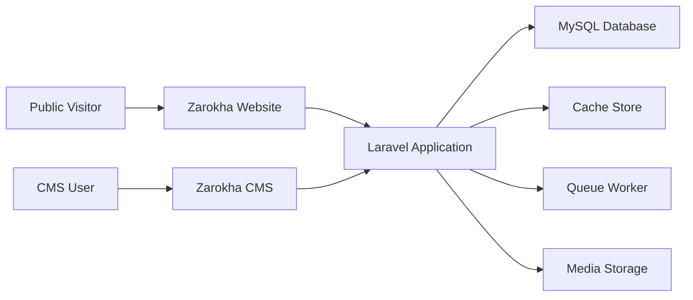

# Context Diagram

## System Context

## Context Notes

- Public visitors use the public website for browsing, search, and inquiries.
- CMS users manage catalogue, content, SEO, and inquiries through the authenticated admin interface.
- The Laravel application is the central backend for both public and admin experiences.
- MySQL stores operational and content data.
- Cache improves repeat-read performance and reduces repeated computation.
- Queue workers handle slow or retryable work outside the request cycle.
- Media storage holds approved uploaded assets and generated derivatives according to later implementation rules.
