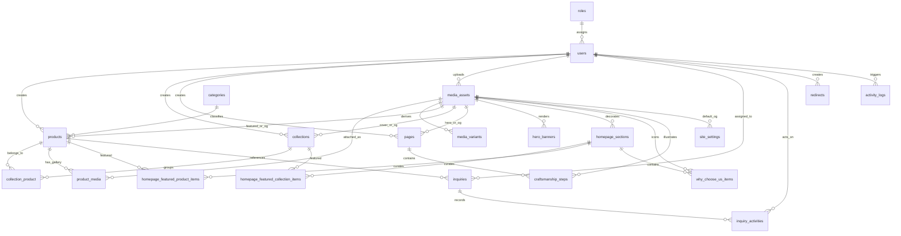

# ERD

## Entity Relationship Diagram

## Relationship Notes

- Products have one required category and zero or more collections.
- Collections curate products through `collection_product`, which includes explicit ordering.
- Products use `featured_media_id` for the primary image and `product_media` for ordered galleries.
- Static pages are fixed-route records keyed by `page_key`.
- Homepage section configuration is typed enough for launch and uses specific child tables for curated collection and product lists.
- Redirects are path-based rather than strictly entity-bound so slug history remains flexible across route types.
